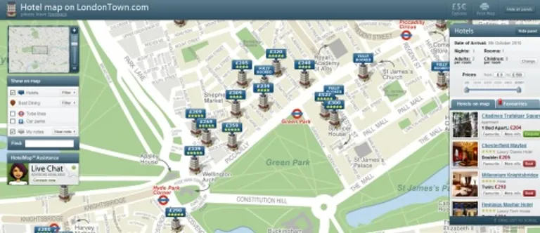

# Map-Based Hotel Booking System

A map-based hotel booking web application that allows users to explore nearby hotels on an interactive map, view hotel details, and simulate hotel bookings.

## Features
- Display hotels on an interactive map
- Show hotel list with price and location
- Click map marker to view hotel details
- Hotel details page
- Booking simulation (no real payment)

## Tech Stack
- PHP
- MySQL
- HTML
- CSS
- JavaScript
- Google Maps API

## Project Structure

## Demo

