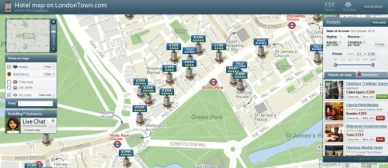

# 🏨 Map Based Hotel Booking – WordPress Plugin

This project displays hotel locations on an interactive Google Map with dynamic markers.
When a user clicks on a marker, detailed information about the hotel is shown, including price, images, and basic details.

The system allows users to easily evaluate:

📍 The exact location of the hotel

🚉 Distance from railway stations, metro stations, or bus stops

🏨 Hotel interior preview through images

⭐ Overall hotel rating

Location plays a crucial role in hotel booking decisions.
This platform helps users visually analyze the surroundings before booking, ensuring better decision-making.

The interface is designed to be clean, simple, and user-friendly, allowing users to explore hotel locations and details effortlessly.


---

## 🚀 Features

- 📍 Google Maps integration with hotel location pins
- 🏨 Nearby hotel listing below the map
- 💰 Price display for each hotel
- 🖼️ Hotel image preview
- 📖 Basic booking simulation page
- 🔌 WordPress plugin-based architecture

---

## 🛠️ Tech Stack

- **WordPress**
- **PHP**
- **JavaScript**
- **Google Maps JavaScript API**
- **MySQL**

---

## 📸 Screenshots


### 🗺️ Map View


### 🏨 Nearby Hotels Listing


### 📖 Booking Page


---

## 📂 Project Structure

```
map-based-hotel-booking/
│
├── api/                # Backend API endpoints (e.g., get_hotels.php)
├── config/             # Database configuration (db.php)
├── public/             # Booking page (book.php)
├── assets/             # CSS, JS, images
├── map-based-hotel-booking.php   # Main plugin file
└── README.md
```

---

## ⚙️ Installation Guide

### 1️⃣ Clone the Repository

```bash
git clone https://github.com/shishir-21/map-based-hotel-booking.git
```

### 2️⃣ Move Plugin to WordPress

Copy the project folder into:

```
wp-content/plugins/
```

### 3️⃣ Activate Plugin

- Go to WordPress Admin Panel  
- Navigate to **Plugins**
- Activate **Map Based Hotel Booking**

---

## 🔑 Google Maps API Setup

1. Go to **Google Cloud Console**
2. Enable **Maps JavaScript API**
3. Generate an API Key
4. Replace `YOUR_API_KEY` in the JavaScript file where Google Maps is initialized

Example:

```javascript
<script src="https://maps.googleapis.com/maps/api/js?key=YOUR_API_KEY"></script>
```

---

## 🗄️ Database Configuration

Open:

```
config/db.php
```

Update your database credentials:

```php
$host = "localhost";
$username = "your_db_username";
$password = "your_db_password";
$database = "your_database_name";
```

Make sure your MySQL server is running.

---

## 📌 How It Works

1. Hotels are fetched from the backend API.
2. Locations are plotted on Google Maps as markers.
3. Clicking a marker displays hotel information.
4. A list of nearby hotels is shown below the map.
5. Users can navigate to the booking page.

---

## 🚀 Future Enhancements

- ✅ Payment gateway integration
- ✅ User authentication & login system
- ✅ Admin dashboard for hotel management
- ✅ Ratings & reviews system
- ✅ Real-time availability tracking
- ✅ Distance-based hotel sorting

---

## 🤝 Contributing

Contributions are welcome!

If you'd like to improve this project:
1. Fork the repository
2. Create a new branch
3. Make your changes
4. Submit a Pull Request

---

## 📌 About

This project was built as a practical implementation of a map-driven hotel booking system to simulate real-world travel platforms like OYO.

It showcases:
- API integration
- Backend & frontend connection
- WordPress plugin development
- Google Maps integration

---

## 📄 License

This project is open-source and available for educational purposes.


## Demo


